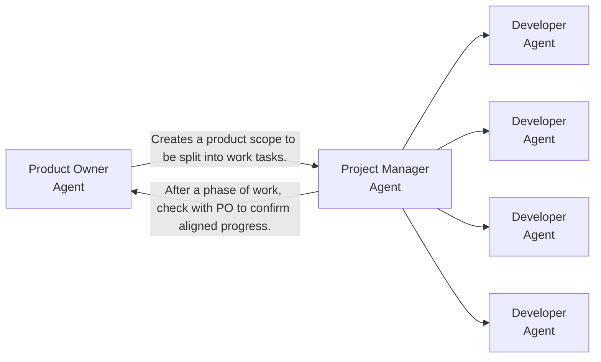

# Agentic Project Template

This is a template repository for building agentic projects. It is intended to be used as a starting point for new projects and can be customized to fit the specific needs of the project.

## Usage

There are pre-defined roles in the agents file to help setup an orchestrated development team with a product owner, project manager and developers. A human-orchestrator is needed to kickoff work and aid coordination depending on the defined project.



## Template structure

Below is the directory structure provided out-of-the-box by this template:

```text
.
├── .agents/
│   ├── context/
│   │   └── context-library.md
│   ├── development/
│   │   └── development-agents.md
│   ├── product/
│   │   └── .gitkeep
│   └── skills/
│       ├── context-sorter/
│       │   └── SKILL.md
│       └── development-tracker/
│           └── SKILL.md
├── src/
│   └── .gitkeep
├── AGENTS.md
└── README.md
```

### Key Components

| Component | Path | Description |
| :--- | :--- | :--- |
| **Agent Roles & Guidelines** | [AGENTS.md](AGENTS.md) | Defines prompt instructions, project context lookups, and specific constraints for Developer, Project Manager, and Product Owner roles. |
| **Agent Task Registry** | [.agents/development/development-agents.md](.agents/development/development-agents.md) | Maps agent codenames and conversation IDs to durability notes and recent work logs. |
| **Context Library Catalog** | [.agents/context/context-library.md](.agents/context/context-library.md) | Indexes reusable context documents so agents can quickly identify and consume relevant workspace information. |
| **Product Scoping Folder** | [.agents/product/](.agents/product/) | Contains scoping documents and product requirements created by the Product Owner. |
| **Context Sorter Skill** | [.agents/skills/context-sorter/SKILL.md](.agents/skills/context-sorter/SKILL.md) | Automates the workflow of importing files/folders into the context library and updating the catalog. |
| **Development Tracker Skill** | [.agents/skills/development-tracker/SKILL.md](.agents/skills/development-tracker/SKILL.md) | Automates registering new agent identities, tracking tasks, updating the roster, and logging activities in journals. |

> [!IMPORTANT]
> **Template Setup Instruction for Agents:**
> Overwrite this `README.md` file with project-specific documentation as your first action. Do not delete the file itself; clear its contents and replace them with details relevant to the project being built.
