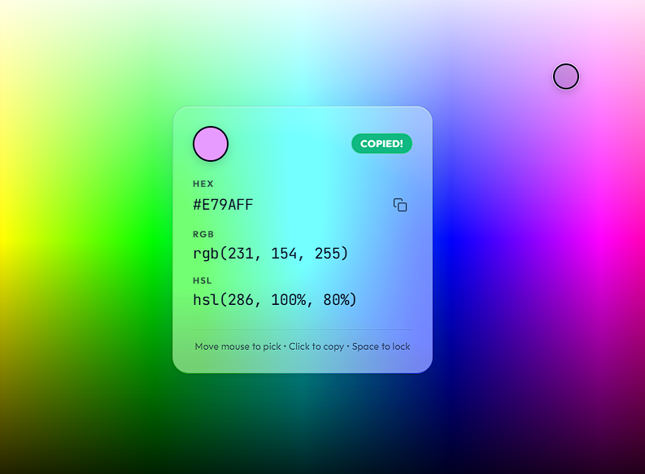

# Gaspra Colour Picker

Gaspra Colour Picker is a simple, modern, and highly interactive .NET web application that transforms the entire browser window into a continuous color palette. As users move their mouse across the viewport, the center of the screen displays real-time HEX, RGB, and HSL color readouts on a premium glassmorphic card, making it incredibly fast and satisfying to find and copy colors.



## How It Works

1. **Explore**: Move your cursor or drag your finger horizontally to sweep through Hues ($0^\circ - 360^\circ$) and vertically to sweep through Lightness and Saturation levels, covering the full visible color spectrum.
2. **Lock/Freeze Selection**: Press the `Spacebar` on desktop or release your finger on touch screens to freeze the color selection. This allows you to inspect readouts or click specific copy triggers without losing your selected color.
3. **Instant Copy**: Click anywhere (desktop) or tap the docked HUD (mobile) to copy the HEX code to your clipboard. An animated "COPIED!" badge appears on the card accompanied by a smooth, coordinate-centered color ripple.

## Features

- **Full-Viewport Palette**: An interactive color gradient covering 100% of the browser window.
- **Glassmorphism HUD**: A beautifully styled center display that shows HEX, RGB, and HSL values.
- **Click-to-Copy**: Click anywhere to copy the HEX code instantly to your clipboard, accompanied by a visual ripple effect and HUD notification.
- **Dynamic Text Legibility**: The HUD automatically switches between light and dark modes based on the background color brightness to ensure readability.
- **Keyboard Lock (`Spacebar`)**: Freeze the current color selection to let you inspect details, copy values manually, or move your mouse off-screen without losing your color.

## Project Structure

The project follows an agent-driven development layout:

```text
.
├── .agents/                    # Agent specifications and logs
│   ├── context/                # Indexed context documents for agents
│   ├── development/            # Developer agent tracking and journals
│   └── product/                # Scoping documents by the Product Owner
├── src/                        # Main web application (contained here)
│   ├── Program.cs              # ASP.NET Core minimal api entry point
│   ├── GaspraColourPicker.csproj
│   └── wwwroot/                # Front-end static assets
│       ├── index.html          # HTML structure
│       ├── style.css           # Premium vanilla CSS styling
│       └── app.js              # Gradient math & copy logic
├── AGENTS.md                   # Instructions and rules for AI agents
└── README.md                   # This documentation
```

## Getting Started

### Prerequisites

- [.NET 8.0 SDK](https://dotnet.microsoft.com/download) or later.
- A modern web browser.

### Running the Application

1. Open a terminal and navigate to the project directory.
2. Navigate into the `src` folder:
   ```powershell
   cd src
   ```
3. Run the development server:
   ```powershell
   dotnet run
   ```
4. Open your browser and navigate to `http://localhost:5000` (or the port specified in the console output) to begin picking colors!

## Development and Agent Team

This repository was built using an orchestrated agent team:
- **Product Owner** (`ivory-glacier-falcon`): Scopes requirements and maintains product guidelines.
- **Project Manager** (`golden-canyon-eagle`): Organizes, schedules, and delegates tasks to developer agents.
- **Developers**: Implement coding tasks in a test-driven manner inside `src/`.

---

## Case Study: Agentic Workflow & Template Analysis (Whitepaper)

This section serves as a case study and guide for developer teams on how this repository's agentic workflow and template structure were utilized to build the Gaspra Colour Picker from scratch.

### 1. Project Timeline & Development Metrics

The complete application was scoped, designed, implemented, and verified in **34 minutes** of active wall-clock execution time (derived directly from Git check-in timestamps):

| Phase | Agent Role | Codename | Time Spent (Actual) | Key Deliverables |
| --- | --- | --- | --- | --- |
| **Product Scoping** | Product Owner | `ivory-glacier-falcon` | 13 mins | Defined core requirements, UI rules, and mobile behavior in [.agents/product/product-scope.md](.agents/product/product-scope.md). |
| **Task Allocation** | Project Manager | `golden-canyon-eagle` | 3 mins | Analyzed scope, split tasks into 3 distinct phases, and created workspaces under `.agents/development/`. |
| **Phase 1: Backend** | Developer | `amber-canyon-wolf` | 5 mins | Initialized ASP.NET Core minimal host, configured static routes, and set up xUnit integration tests. |
| **Phase 2: Frontend** | Developer | `emerald-forest-badger` | 6 mins | Built HSL gradient math, glassmorphic HUD layout, luminance calculations, and automated JS math tests. |
| **Phase 3: Mobile/UX** | Developer | `sapphire-ocean-dolphin` | 4 mins | Unified Pointer Events, docked HUD styles, click ripple overlays, and mock DOM interaction tests. |
| **Final Quality QA** | Project Manager | `golden-canyon-eagle` | 3 mins | Ran full C#/JS test pipeline, verified acceptance criteria, and finalized documentation. |

**Total Cumulative Time**: 34 minutes, 5 seconds.

---

### 2. Work Developed

The system architecture spans both backend routing and complex frontend interactions:
- **Backend Host**: Serves the application statically from `src/wwwroot/` with optimal caching and fallback headers.
- **Color Engine (`color-math.js`)**: Maps coordinates to HSL, converts to RGB/HEX, and applies the WCAG relative luminance formula ($L = 0.2126 \times R + 0.7152 \times G + 0.0722 \times B$) to keep HUD text contrast high.
- **State Machine (`app.js`)**: Handles mouse tracking, spacebar locks, unified touch pointer gestures, and viewport scroll locks on touch devices.
- **Testing Architecture**: Uses xUnit for routing tests and native Node.js ESM modules (`assert`) for JS tests, which are fully integrated into the MSBuild build-and-test cycle.

---

### 3. How to Use the Template (Developer Guide)

To replicate this high-fidelity workflow on other projects, developers should follow the standard lifecycle rules defined in [AGENTS.md](AGENTS.md):

#### Step 1: Requirements Definition (Product Owner)
* **Action**: Create a comprehensive scoping file (e.g., `product-scope.md`) inside `.agents/product/`.
* **Standard**: Be explicit about technical stack limitations, design systems (fonts, colors, blur parameters), accessibility rules, and mobile behaviors. Do not begin planning or implementation until the scope is versioned and finalized.

#### Step 2: Work Chunking & Initialization (Project Manager)
* **Action**:
  1. Break the scope into sequential, logical work chunks where each phase has clear boundaries and satisfying dependencies.
  2. Create a development workspace folder for each agent under `.agents/development/<codename>/`.
  3. Initialize each workspace with two files:
     - `agent.md`: Defines the role, conversation IDs, and context boundaries.
     - `instructions.md`: Provides a clear `Definition of Ready`, task description, checklist of steps, and handoff instructions.
  4. Register all agents in the centralized [.agents/development/development-agents.md](.agents/development/development-agents.md) roster.

#### Step 3: Test-Driven Development (Developers)
* **Action**: 
  1. Set the instructions file status to `Pending` and review dependencies.
  2. Build a test suite representing the target behavior *before* writing the primary implementation code (TDD).
  3. Confine all production work within the `src/` directory to keep the repository root clean.
  4. Write tests for mathematical and algorithmic functions as pure, side-effect-free functions so they can run inside lightweight headless test runners.

#### Step 4: Verification & Handoff (Developers & PM)
* **Action**:
  1. Run the test commands to verify all assertions pass.
  2. Check items off in `instructions.md` and set the status to `Completed`.
  3. Add an entry to the agent's local `journal.md` describing outcomes, decisions, validation steps, and future follow-ups.
  4. Update the roster in `development-agents.md` with the completed log and handoff status.

---

### 4. Assessment of the Agentic Workflow

Implementing a project using this structured template offers major advantages over ad-hoc generation:

* **No Context Drift**: By creating isolated instructions and assigning dedicated, narrow developer roles (e.g., `emerald-forest-badger` solely focused on core layout and math, while `sapphire-ocean-dolphin` refined mobile UX), the agents avoided context bloating. This resulted in zero compilation failures, highly focused code, and precise logic.
* **TDD Quality Enforcement**: The `AGENTS.md` TDD rules forced the developers to build a testing pipeline from day one. Integrating the Node.js unit tests directly into `dotnet test` meant that any regression on the frontend or backend would instantly break the build, securing long-term code quality.
* **Perfect Traceability**: The activity journals (`journal.md`) created a durable, human-readable audit trail of every design choice (such as using coordinate-based math instead of canvas checks to prevent performance lag, and using pointer-release toggles to lock mobile state).
* **Clear Task Hand-offs**: The dependencies listed in `instructions.md` established a natural phasing mechanism, allowing the project to proceed smoothly without conflicts or code regression between frontend and backend.
